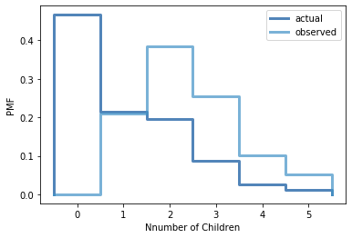

[Think Stats Chapter 3 Exercise 1](http://greenteapress.com/thinkstats2/html/thinkstats2004.html#toc31) (actual vs. biased)

*pmf = thinkstats2.Pmf(resp.numkdhh, label='actual')*  
*biased_pmf = BiasPmf(pmf, label='observed')*  
*thinkplot.preplot(2)*  
*thinkplot.Pmfs([pmf,biased_pmf])*  
*thinkplot.config(xlabel='Nnumber of Children',ylabel='PMF')*  
  

  
*print('Actual mean is ',pmf.Mean())*  
*print('Biased mean is ',biased_pmf.Mean())*  
  
**Actual mean is  1.024205155043831**  
**Biased mean is  2.403679100664282**
