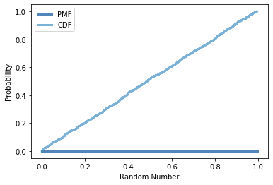

[Think Stats Chapter 4 Exercise 2](http://greenteapress.com/thinkstats2/html/thinkstats2005.html#toc41) (a random distribution)

*rand_1000 = np.random.random(1000)*  
*pmf = thinkstats2.Pmf(rand_1000, label='PMF')*  
*cdf = thinkstats2.Cdf(rand_1000, label='CDF')*  
*thinkplot.PrePlot(2)*  
*thinkplot.Cdfs([pmf,cdf])*  
*thinkplot.config(xlabel='Random Number',ylabel='Probability')*  
  

